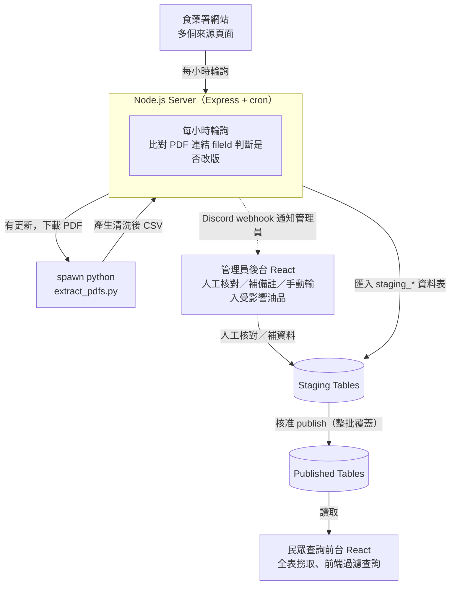

# 問題油品查詢系統（Oil Search）

> 監控台灣衛福部食藥署「問題油品」回收公告 → 自動重抽 PDF 資料 → 管理員後台審核 → 發布給民眾查詢的全流程系統。

從一支 PDF 資料清洗腳本，演進成一套涵蓋**自動化資料擷取、人工審核、公開查詢**的完整資料流水線（data pipeline）。以 npm workspaces 管理的 monorepo。

---

## 專案背景

食藥署在食安事件（如問題油品回收）發生時，會在網站上以 PDF 公告受影響的下游業者、預防性下架產品等清單。這些 PDF：

- **格式脆弱**：由表格轉出，常有 `None` 空格、每頁重複的表頭、單一儲存格內用 `\n` 塞多筆值。
- **會更新**：食藥署隨事件進展多次改版，需要持續追蹤。
- **對民眾不友善**：一般人難以在數百列的 PDF 裡查到自己買的產品是否受影響。

本系統把「公告 PDF」轉成「可查詢的結構化資料」，並在 AI 自動擷取與人工審核之間取得平衡——**機器負責重複的抽取工作，人負責把關正確性**。

---

## 系統架構



兩條進料路徑匯流到同一套 staging/審核/發布邏輯（`ingest/extractAndStage.js`）：

1. **自動輪詢**：`node-cron` 每小時解析食藥署列表頁，比對下載連結的 `fileId`，有變動才下載並重抽。
2. **手動上傳**：管理員直接上傳 PDF（`POST /api/admin/upload`），不必等排程即可先跑通全流程。

---

## Monorepo 結構

```
oil-search/
├── package.json                 # npm workspaces root
├── docker-compose.yml           # server 服務（Node + Python 同一 image）
└── packages/
    ├── extract-pdfs/            # Python / pdfplumber 抽取腳本
    │   └── extract_pdfs.py       #   --doc-type / --input / --output CLI 介面
    ├── server/                  # Express + node-cron + Prisma(SQLite)
    │   ├── prisma/schema.prisma  #   SourceDocument + 各資料的 staging / published 表
    │   └── src/
    │       ├── ingest/          #   找連結、下載＋hash比對、spawn python、CSV 匯入
    │       ├── cron/            #   每小時輪詢 pollFdaUpdates.js
    │       ├── notify/          #   Discord webhook
    │       └── api/{admin,public}
    ├── admin-web/               # Vite + React + Ant Design 管理後台
    ├── public-web/              # Vite + React 民眾查詢前台
    └── ui/                      # 跨前端共用元件（@oil-search/ui）
```

---

## 技術棧

| 層 | 技術 |
|----|------|
| 資料擷取 | Python、pdfplumber |
| 後端 | Node.js、Express、node-cron、Prisma ORM、SQLite |
| 前端 | React 19、Vite、React Router、Ant Design（後台）|
| 整合 | multer 檔案上傳 |
| 部署 | Docker（Node + Python 單一 image）、docker-compose |

---

## 核心技術亮點

### 1. 脆弱 PDF 表格的三階段清洗（`extract_pdfs.py`）

`pdfplumber` 抽出的原始表格對版面極度敏感，因此每份 PDF 有專屬清洗器：

- **`extract_raw_tables`**：逐頁抽原始列，不做任何清理。
- **Per-PDF 清洗**：
  - `clean_downstream_list`（下游業者 360 家清單）：對跨列的 `None` 儲存格**前向填補**（forward-fill）序號／縣市／業者；對單格內用 `\n` 塞多筆的批號／有效日期做**展開**（explode）。透過比對品項／批號／有效日期各欄的行數（`n_bd` 邏輯），區分「文字換行」與「真的有多筆值」。**無法有把握還原的列，寫進 `備註` 欄留給人工複核，而不是丟棄或猜測。**
  - `clean_recall_list`（預防性下架清單）：列本身已完整，只清掉有效日期裡的雜散 `\n`。
- **`write_csv`**：輸出 `utf-8-sig`（帶 BOM），確保繁中表頭在 Windows Excel 正常開啟。

`main()` 依 `--doc-type` 分派到對應清洗器與 CSV 欄位，並印出摘要（下游清單會回報被標記待複核的列數）。

### 2. 靠連結 fileId 判斷版本，不盲抓 PDF

輪詢時只解析 HTML 列表頁，取出 `GetFile.ashx?id=...` 連結字串比對 `fileId`——**連結沒變就完全不下載 PDF**，把外部請求與 Python 抽取都省下來。

### 3. Staging → Published 的雙表審核流程

Prisma schema 為每種資料設計 `Staging*` 與 published 兩張表：抽取結果先進 staging，管理員在後台核對、補 `reviewedNote` 後才 publish（整批覆蓋）到公開表。SourceDocument 以 `status`（`link_only` / `new` / `extracted` / `pending_review` / `published` / `failed`）追蹤每份 PDF 的生命週期。

### 4. 機器抽取與人工輸入並存

並非所有資料都適合機器抽取：

- **可自動抽取**：下游業者清單、預防性下架清單。
- **純人工輸入**：受影響油品資訊（圖配文 PDF）、回收統計數字、下游流向圖（PDF 逐頁轉圖直接發布）。

後台用同一套 UI 語彙統一了這兩類資料的審核／輸入與發布體驗。

### 5. 前端全表撈取、客戶端過濾

公開查詢採「整表撈回、前端過濾」而非後端分頁查詢——資料量在數千列等級時這樣更簡單、體驗更即時（詳見 `doc/`；僅在單表成長到約 1–3 萬列以上時才需重新評估）。

---

## API 一覽

**公開 API**（`/api/public`）
| Method | Path | 說明 |
|--------|------|------|
| GET | `/downstream-vendors` | 下游業者清單 |
| GET | `/recall-products` | 預防性下架產品 |
| GET | `/affected-oils` | 受影響油品資訊 |
| GET | `/recall-stats` | 回收統計 |
| GET | `/flow-chart` | 下游流向圖 |
| GET | `/news` | 最新消息 |

**管理 API**（`/api/admin`）
| Method | Path | 說明 |
|--------|------|------|
| POST | `/upload` | 手動上傳來源 PDF |
| GET | `/staging/downstream-vendors`、`/staging/recall-products` | 取待審核資料 |
| POST | `/publish/*` | 各類資料整批發布 |
| POST | `/affected-oil-pics`、`/flow-chart` | 圖片／流向圖上傳 |

---

## 本機執行

**PDF 抽取腳本（單獨執行）**

```bash
python packages/extract-pdfs/extract_pdfs.py \
  --doc-type downstream_vendors \
  --input "source data/下游業者360家清單_(截至7月9日).pdf" \
  --output "output/下游業者清單.csv"
```

`--doc-type`、`--input`、`--output` 皆為必填；需要 `pdfplumber`。

**完整系統**

```bash
npm install                                  # repo 根目錄，安裝所有 workspace
cd packages/server && cp .env.example .env   # 填入 DISCORD_WEBHOOK_URL 等
npx prisma migrate dev                       # 建立 SQLite 資料庫
npm run dev                                  # Express 啟動於 :3000，含每小時 cron
```

`admin-web`、`public-web` 為標準 Vite 專案（各自 `npm run dev`）。根目錄 `docker-compose.yml` 以單一 image 執行 server 服務，SQLite 以掛載 volume 上的檔案存在（無獨立資料庫容器）。

---

## 設計取捨

- **SQLite**：資料量小、單機部署、以檔案形式掛載 volume——省去獨立資料庫容器的維運。
- **前端過濾而非後端分頁**：在目前資料規模下更簡單、查詢更即時。
- **保留每個 PDF 版本**：輪詢下載的原始 PDF 版本化存進 `source data/_archive/`（gitignored），保留可回溯性。
- **人工把關優先**：機器不確定的資料一律標記待複核，正確性由人決定。
